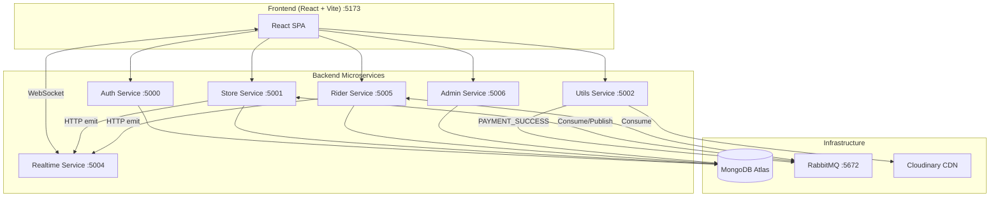
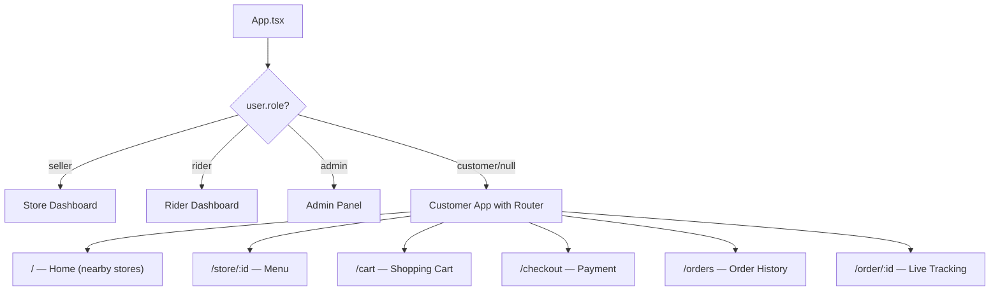
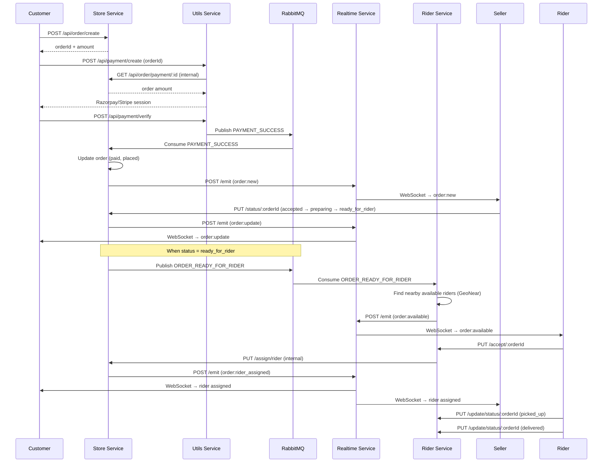

# GoKart — Hyperlocal Commerce Platform: Full Project Walkthrough

## Overview

This is a **microservices-based hyperlocal food delivery platform** (similar to Zomato/Swiggy) built with:

- **Backend**: 6 independent Node.js/Express services in TypeScript
- **Frontend**: React 19 + Vite + TailwindCSS 4 + TypeScript
- **Database**: MongoDB (via Mongoose for most services, native MongoDB driver for Admin)
- **Message Broker**: RabbitMQ (async event-driven communication)
- **Real-time**: Socket.IO (live order status updates)
- **Payments**: Razorpay + Stripe (dual gateway)
- **Image Storage**: Cloudinary
- **Auth**: Google OAuth 2.0 + JWT
- **Maps**: Leaflet + OpenStreetMap (geolocation, routing)
- **Containerization**: Docker Compose

---

## Architecture Diagram



---

## Service Breakdown

### 1. Auth Service (`:5000`)

| Aspect | Detail |
|--------|--------|
| **DB** | MongoDB → `authDB` |
| **Auth Flow** | Google OAuth 2.0 → JWT (15-day expiry) |
| **Env Vars** | `MONGO_URI`, `JWT_SEC`, `GOOGLE_CLIENT_ID`, `GOOGLE_CLIENT_SECRET` |

**Routes** — prefix: `/api/auth`
| Method | Path | Auth | Description |
|--------|------|------|-------------|
| POST | `/login` | ❌ | Exchange Google auth code for JWT + user |
| PUT | `/add/role` | ✅ | Set user role (`customer`/`rider`/`seller`) |
| GET | `/me` | ✅ | Get current user profile |

**User Model**: `name`, `email`, `image`, `role` (nullable, set after first login)

**Key Design**: Users start with `role: null` and must select a role (`customer`, `rider`, `seller`) after first login. The JWT embeds the full user object.

---

### 2. Store Service (`:5001`)

| Aspect | Detail |
|--------|--------|
| **DB** | MongoDB → `storeDB` |
| **Message Broker** | RabbitMQ — publishes `ORDER_READY_FOR_RIDER`, consumes `PAYMENT_SUCCESS` |
| **Env Vars** | `MONGO_URI`, `JWT_SEC`, `RABBITMQ_URL`, `PAYMENT_QUEUE`, `ORDER_READY_QUEUE`, `RIDER_QUEUE`, `INTERNAL_SERVICE_KEY`, `REALTIME_SERVICE`, `UTILS_SERVICE` |

**Routes**:

| Prefix | Method | Path | Auth | Description |
|--------|--------|------|------|-------------|
| `/api/store` | POST | `/add` | ✅ + multer | Register store with image upload |
| `/api/store` | GET | `/my` | ✅ | Fetch seller's own store |
| `/api/store` | PUT | `/update/status` | ✅ | Toggle open/closed |
| `/api/store` | PUT | `/update` | ✅ | Update name/description |
| `/api/store` | GET | `/nearby` | ❌ | GeoNear query for nearby stores |
| `/api/store` | GET | `/:id` | ❌ | Get single store |
| `/api/item` | POST | `/add` | ✅ + multer | Add menu item with image |
| `/api/item` | GET | `/all/:id` | ✅ | List items for store |
| `/api/item` | DELETE | `/:itemId` | ✅ | Delete menu item |
| `/api/item` | PUT | `/toggle/:itemId` | ✅ | Toggle item availability |
| `/api/cart` | POST | `/add` | ✅ | Add item to cart |
| `/api/cart` | GET | `/all` | ✅ | Fetch user's cart |
| `/api/cart` | PUT | `/increment` | ✅ | Increase quantity |
| `/api/cart` | PUT | `/decrement` | ✅ | Decrease quantity / remove |
| `/api/cart` | DELETE | `/clear` | ✅ | Clear entire cart |
| `/api/address` | POST | `/add` | ✅ | Add delivery address |
| `/api/address` | DELETE | `/:id` | ✅ | Delete address |
| `/api/address` | GET | `/all` | ✅ | List user's addresses |
| `/api/order` | POST | `/create` | ✅ | Create order from cart |
| `/api/order` | GET | `/my` | ✅ | User's order history |
| `/api/order` | GET | `/:id` | ✅ | Single order detail |
| `/api/order` | GET | `/store/:storeId` | ✅ | Store's orders |
| `/api/order` | PUT | `/status/:orderId` | ✅ | Update order status (seller) |
| `/api/order` | GET | `/payment/:id` | Internal | Fetch order for payment processing |
| `/api/order` | PUT | `/assign/rider` | Internal | Assign rider to order |
| `/api/order` | GET | `/current/rider` | Internal | Get rider's current active order |
| `/api/order` | PUT | `/update/status/rider` | Internal | Rider updates order status |

**Data Models**:
- **Store**: name, description, image, ownerId, phone, isVerified, autoLocation (GeoJSON Point), isOpen
- **MenuItem**: storeId, name, description, image, price, isAvailable
- **Cart**: userId, storeId, itemId, quantity — enforces single-store cart
- **Address**: userId, mobile, formattedAddress, location (GeoJSON Point)
- **Order**: Full order lifecycle with 8 statuses, delivery fee calculation, platform fee, distance-based rider pay

---

### 3. Utils Service (`:5002`)

| Aspect | Detail |
|--------|--------|
| **Purpose** | Centralized image uploads + payment processing |
| **Message Broker** | RabbitMQ — publishes `PAYMENT_SUCCESS` to payment queue |
| **Env Vars** | `CLOUD_NAME`, `CLOUD_API_KEY`, `CLOUD_SECRET_KEY`, `RAZORPAY_KEY_ID`, `RAZORPAY_KEY_SECRET`, `STRIPE_SECRET_KEY`, `RABBITMQ_URL`, `PAYMENT_QUEUE`, `STORE_SERVICE`, `INTERNAL_SERVICE_KEY`, `FRONTEND_URL` |

**Routes**:

| Method | Path | Description |
|--------|------|-------------|
| POST | `/api/upload` | Upload base64 image to Cloudinary |
| POST | `/api/payment/create` | Create Razorpay order |
| POST | `/api/payment/verify` | Verify Razorpay payment → publish event |
| POST | `/api/payment/stripe/create` | Create Stripe checkout session |
| POST | `/api/payment/stripe/verify` | Verify Stripe session → publish event |

---

### 4. Realtime Service (`:5004`)

| Aspect | Detail |
|--------|--------|
| **Purpose** | WebSocket hub for live order updates |
| **Tech** | Socket.IO server over HTTP |
| **Env Vars** | `PORT`, `JWT_SEC`, `INTERNAL_SERVICE_KEY` |

**How it works**:
1. Frontend connects via Socket.IO with JWT auth token
2. On connect, users join room `user:{userId}`; sellers also join `store:{storeId}`
3. Other services POST to `/api/v1/internal/emit` (protected by `x-internal-key`) to broadcast events
4. Events: `order:new`, `order:update`, `order:rider_assigned`, `order:available`

---

### 5. Rider Service (`:5005`)

| Aspect | Detail |
|--------|--------|
| **DB** | MongoDB → `riderDB` |
| **Message Broker** | RabbitMQ — consumes `ORDER_READY_FOR_RIDER` events |
| **Env Vars** | `MONGO_URI`, `JWT_SEC`, `PORT`, `RABBITMQ_URL`, `ORDER_READY_QUEUE`, `STORE_SERVICE`, `REALTIME_SERVICE`, `UTILS_SERVICE`, `INTERNAL_SERVICE_KEY` |

**Routes** — prefix: `/api/rider`
| Method | Path | Auth | Description |
|--------|------|------|-------------|
| POST | `/add` | ✅ + multer | Create rider profile (Aadhar, DL, photo) |
| GET | `/me` | ✅ | Get rider profile |
| PUT | `/toggle` | ✅ | Toggle online/offline + update location |
| PUT | `/accept/:orderId` | ✅ | Accept an available order |
| GET | `/current/order` | ✅ | Get current active order |
| PUT | `/update/status/:orderId` | ✅ | Update order status (picked_up → delivered) |

**Rider Model**: userId, picture, phoneNumber, aadharNumber, drivingLicenseNumber, isVerified, location (GeoJSON), isAvailable, lastActiveAt

---

### 6. Admin Service (`:5006`)

| Aspect | Detail |
|--------|--------|
| **DB** | Direct MongoDB driver (reads from store & rider DBs) |
| **Purpose** | Verify stores and riders |
| **Env Vars** | `PORT`, `JWT_SEC`, `STORE_DB_URI`, `RIDER_DB_URI` |

**Routes** — prefix: `/api/v1`
| Method | Path | Auth | Description |
|--------|------|------|-------------|
| GET | `/admin/store/pending` | ✅ + admin | List unverified stores |
| GET | `/admin/rider/pending` | ✅ + admin | List unverified riders |
| PATCH | `/verify/store/:id` | ✅ + admin | Verify a store |
| PATCH | `/verify/rider/:id` | ✅ + admin | Verify a rider |

---

## Frontend Architecture

**Stack**: React 19, Vite 7, TailwindCSS 4, TypeScript, React Router v7

### Role-Based Routing

The frontend renders completely different UIs based on user role:



### Key Frontend Files

| File | Purpose |
|------|---------|
| [AppContext.tsx](file:///c:/Users/Aashish/OneDrive/Desktop/Dev/Gokart-Hyperlocal%20Commerce%20Platform/frontend/src/context/AppContext.tsx) | Global state — user, location, cart |
| [SocketContext.tsx](file:///c:/Users/Aashish/OneDrive/Desktop/Dev/Gokart-Hyperlocal%20Commerce%20Platform/frontend/src/context/SocketContext.tsx) | Socket.IO connection management |
| [main.tsx](file:///c:/Users/Aashish/OneDrive/Desktop/Dev/Gokart-Hyperlocal%20Commerce%20Platform/frontend/src/main.tsx) | Service URL constants, Google OAuth provider |
| [types.ts](file:///c:/Users/Aashish/OneDrive/Desktop/Dev/Gokart-Hyperlocal%20Commerce%20Platform/frontend/src/types.ts) | Shared TypeScript interfaces |

### Pages (15 total)

| Page | Role | Function |
|------|------|----------|
| `Home` | Customer | Browse nearby stores on map |
| `StorePage` | Customer | View menu items |
| `Cart` | Customer | Manage cart items |
| `Checkout` | Customer | Address selection + payment |
| `PaymentSuccess` | Customer | Razorpay payment callback |
| `OrderSuccess` | Customer | Stripe payment callback |
| `Orders` | Customer | Order history list |
| `OrderPage` | Customer | Live order tracking with map |
| `Address` | Customer | Add delivery address with map picker |
| `Login` | Public | Google OAuth login |
| `SelectRole` | Authenticated | Choose customer/rider/seller |
| `Account` | Authenticated | Profile page |
| `Store` | Seller | Full store dashboard |
| `RiderDashboard` | Rider | Order requests, current order, map |
| `Admin` | Admin | Verify stores & riders |

### Components (20 total)

Includes: `Navbar`, `Footer`, `HeroSection`, `AboutSection`, `FeaturesSection`, `StoreCard`, `AddStore`, `AddMenuItem`, `MenuItems`, `StoreProfile`, `StoreOrders`, `OrderCard`, `RiderAdmin`, `RiderCurrentOrder`, `RiderOrderMap`, `RiderOrderRequest`, `UserOrderMap`, `AdminStoreCard`, `ProtectedRoute`, `PublicRoute`

---

## Order Lifecycle



---

## Inter-Service Communication

### Synchronous (HTTP with internal key)

| From | To | Purpose |
|------|----|---------|
| Store → Utils | Image upload (Cloudinary) |
| Rider → Utils | Image upload (Cloudinary) |
| Utils → Store | Fetch order for payment |
| Rider → Store | Accept order / fetch current order / update status |
| Store → Realtime | Emit socket events |
| Rider → Realtime | Emit socket events |

All internal HTTP calls are protected by `x-internal-key` header.

### Asynchronous (RabbitMQ)

| Queue | Producer | Consumer | Event |
|-------|----------|----------|-------|
| `PAYMENT_QUEUE` | Utils | Store | `PAYMENT_SUCCESS` — marks order as paid |
| `ORDER_READY_QUEUE` | Store | Rider | `ORDER_READY_FOR_RIDER` — notifies nearby riders |

---

## Database Architecture

Each service manages its own database:

| Service | Database | Collections |
|---------|----------|-------------|
| Auth | `authDB` | `users` |
| Store | `storeDB` | `stores`, `menuitems`, `carts`, `addresses`, `orders` |
| Rider | `riderDB` | `riders` |
| Admin | Reads from `storeDB` + `riderDB` (native MongoDB driver) |

> [!NOTE]
> The Admin service uses the **native MongoDB driver** (not Mongoose) to read directly from the Store and Rider databases for verification purposes. All other services use Mongoose.

---

## Environment Variables Summary

| Variable | Used By |
|----------|---------|
| `MONGO_URI` | Auth, Store, Rider |
| `JWT_SEC` | Auth, Store, Rider, Admin, Realtime |
| `GOOGLE_CLIENT_ID` / `GOOGLE_CLIENT_SECRET` | Auth |
| `RABBITMQ_URL` | Store, Rider, Utils |
| `PAYMENT_QUEUE` | Store, Utils |
| `ORDER_READY_QUEUE` / `RIDER_QUEUE` | Store, Rider |
| `INTERNAL_SERVICE_KEY` | Store, Rider, Utils, Realtime, Admin |
| `REALTIME_SERVICE` | Store, Rider |
| `STORE_SERVICE` | Rider, Utils |
| `UTILS_SERVICE` | Store, Rider |
| `CLOUD_NAME` / `CLOUD_API_KEY` / `CLOUD_SECRET_KEY` | Utils |
| `RAZORPAY_KEY_ID` / `RAZORPAY_KEY_SECRET` | Utils |
| `STRIPE_SECRET_KEY` | Utils |
| `FRONTEND_URL` | Utils |
| `STORE_DB_URI` / `RIDER_DB_URI` | Admin |

---

## Key Technical Patterns

### 1. GeoJSON + 2dsphere Indexing
Stores and Riders use MongoDB GeoJSON `Point` fields with `2dsphere` indexes for proximity queries (`$geoNear`, `$near`). Nearby stores are found within a configurable radius (default 5km).

### 2. Cart Enforcement
The cart enforces single-store ordering — if a user tries to add an item from a different store, they must clear their cart first.

### 3. Order Expiration
Unpaid orders have a `expiresAt` TTL index (15 minutes). Once paid, the `expiresAt` field is `$unset` to prevent auto-deletion.

### 4. Rider Fee Calculation
`riderAmount = Math.ceil(distance_km) × ₹17` per km. Delivery fee for customers is ₹49 if subtotal < ₹250, else free. Platform fee is flat ₹7.

### 5. Image Upload Pipeline
Services don't upload directly to Cloudinary. Instead, they convert files to base64 data URIs and POST to the Utils service `/api/upload` endpoint, which handles the Cloudinary upload and returns the secure URL.

---

## Known Issues & Tech Debt

> [!WARNING]
> **Frontend service URLs are hardcoded to Docker internal hostnames** in [main.tsx](file:///c:/Users/Aashish/OneDrive/Desktop/Dev/Gokart-Hyperlocal%20Commerce%20Platform/frontend/src/main.tsx):
> ```ts
> export const authService = "http://auth:5000";
> export const storeService = "http://store:5001";
> ```
> These Docker-internal hostnames (`auth`, `store`, etc.) won't resolve from a browser. The frontend needs `localhost` URLs for local dev or a proper API gateway/reverse proxy for production.

### Other Issues
- **Typos in schema fields**: `quauntity` (should be `quantity`), `platfromFee` (should be `platformFee`), `fromattedAddress` (should be `formattedAddress`), `cretedAt` (should be `createdAt`), `isAvailble` (should be `isAvailable`)
- **Google Client ID hardcoded** in `main.tsx` instead of using environment variable
- **No API Gateway**: All services are exposed directly; no centralized routing/rate-limiting
- **Missing `.env` files** for rider, admin, and realtime services in the repo
- **No input validation library** (e.g., Zod/Joi) — validation is manual
- **No automated tests** present in any service
- **`acceptOrder` sends `riderName: rider.picture`** — bug, should send user's name
- **Socket event names inconsistent**: `order:rider_assigned` is reused for picked_up and delivered status updates too

---

## Docker Setup

All services are containerized with individual `Dockerfile`s and orchestrated via [docker-compose.yml](file:///c:/Users/Aashish/OneDrive/Desktop/Dev/Gokart-Hyperlocal%20Commerce%20Platform/docker-compose.yml):

| Service | Port | Dependencies |
|---------|------|--------------|
| RabbitMQ | 5672 / 15672 (mgmt) | — |
| Auth | 5000 | RabbitMQ |
| Store | 5001 | RabbitMQ |
| Utils | 5002 | RabbitMQ |
| Realtime | 5004 | RabbitMQ |
| Rider | 5005 | RabbitMQ |
| Admin | 5006 | RabbitMQ |
| Frontend | 5173 | — |

---

## File Structure Summary

```
Gokart-Hyperlocal Commerce Platform/
├── docker-compose.yml
├── frontend/                          # React + Vite + TailwindCSS
│   └── src/
│       ├── App.tsx                    # Role-based routing
│       ├── main.tsx                   # Service URLs, OAuth provider
│       ├── types.ts                   # Shared interfaces
│       ├── context/                   # AppContext, SocketContext
│       ├── pages/ (15)                # Customer, Seller, Rider, Admin views
│       ├── components/ (20)           # Reusable UI components
│       └── utils/                     # Order flow helpers
└── services/
    ├── auth/src/                      # Google OAuth + JWT
    │   ├── config/   (db, googleConfig)
    │   ├── model/    (User)
    │   ├── controllers/ (auth)
    │   ├── middlewares/  (isAuth, tryCatch)
    │   └── routes/   (auth)
    ├── store/src/                # Core business logic
    │   ├── config/   (db, rabbitmq, publisher, consumer, datauri)
    │   ├── models/   (Store, MenuItem, Cart, Address, Order)
    │   ├── controllers/ (store, menuitem, cart, address, order)
    │   ├── middlewares/  (isAuth, tryCatch, multer)
    │   └── routes/   (store, menuitem, cart, address, order)
    ├── rider/src/                     # Rider management
    │   ├── config/   (db, rabbitmq, consumer, datauri)
    │   ├── model/    (Rider)
    │   ├── controllers/ (rider)
    │   ├── middlewares/  (isAuth, tryCatch, multer)
    │   └── routes/   (rider)
    ├── utils/src/                     # Cloudinary + Payments
    │   ├── config/   (rabbitmq, razorpay, verifyRazorpay, payment.producer)
    │   ├── controllers/ (payment)
    │   └── routes/   (cloudinary, payment)
    ├── realtime/src/                  # Socket.IO hub
    │   ├── socket.ts
    │   └── routes/   (internal)
    └── admin/src/                     # Verification panel
        ├── controllers/ (admin)
        ├── middlewares/ (isAuth, isAdmin, tryCatch)
        ├── util/     (collection — MongoDB native driver)
        └── routes/   (admin)
```
